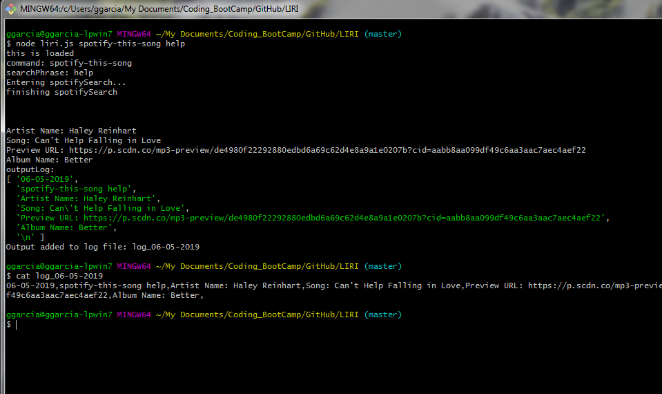
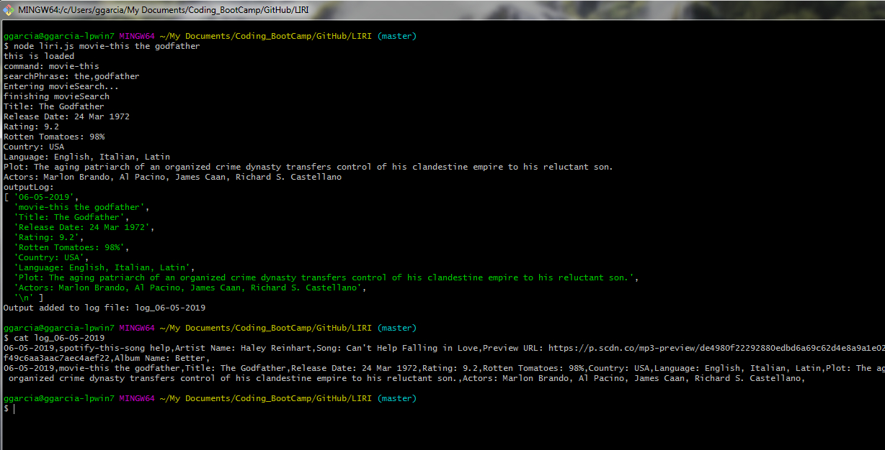
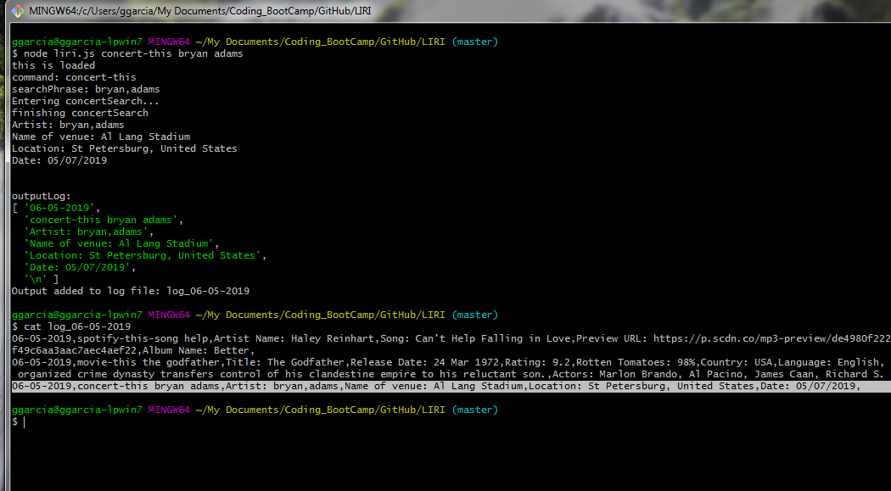
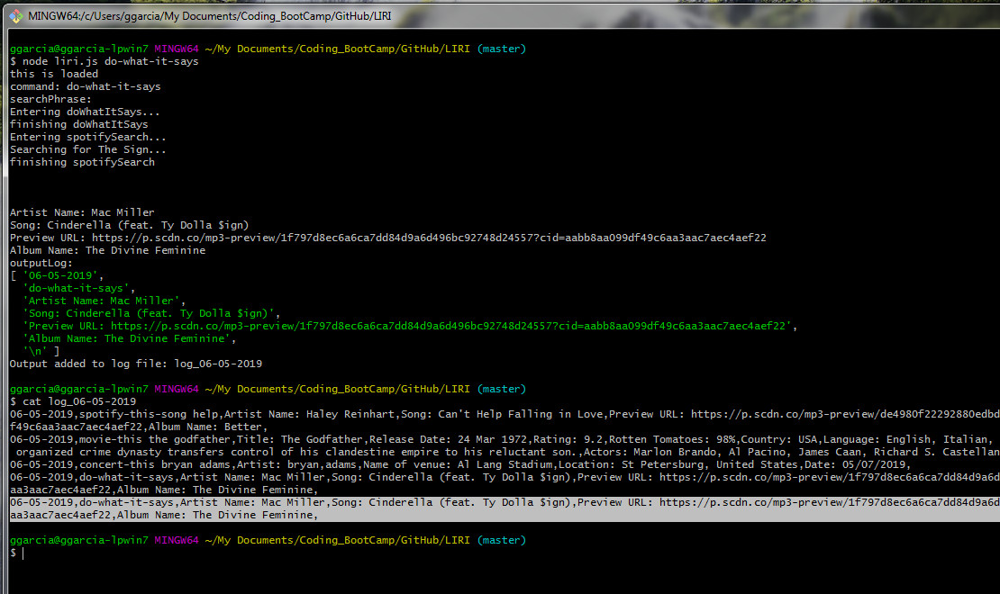
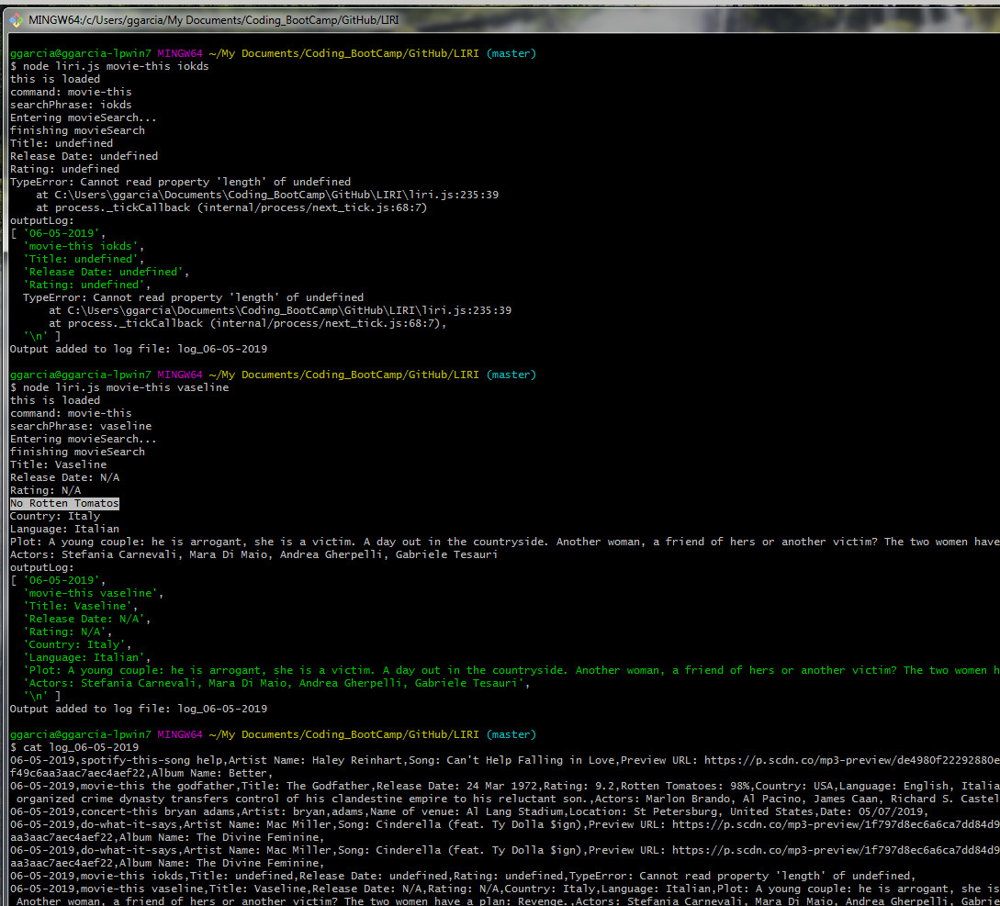

# LIRI

## Goal:
Create a Node application to use external API calls to get: 
- Spotify song information
- Movie information
- Concert information

The application can use a file with pre-loaded commands. 

## Installation 

1. Create a directory on your local computer and download the basic files:
- liri.js
- package.json
- Create a text file called random.txt file with the following line: 
    spotify-this-song,"I Want it That Way"
- Go to spotify to create your own key, otherwise it will not work.
  - Create a file called keys.js with your SPOTIFY_ID and SPOTIFY_SECRET: 
        exports.spotify = {
            id: process.env.SPOTIFY_ID,
            secret: process.env.SPOTIFY_SECRET
        };

2. Open a bash shell terminal and run `npm install` on the directory you downloaded the files from point 1

## Usage 

Go back to the terminal, and use the application as follows: 

- `node liri.js spotify-this-song [song name]`
- `node liri.js movie-this [movie name]`
- `node liri.js concert-this [artist name]`
- `node liri.js do-what-it-says` 

### Notes:

- If no song entered on sopotify-this-song, a default is selected.
- Not all movies have a rotten tomatos ratings. 
- If do-what-it-says is entered, then the random.txt file is read and the command in the first line of the file is executed
- A log file is created for each search with a timestamp.

## Use Cases

### Spotify-this-song
- Brings the information from spotify
- logs the transaction into the log file

### Movie-this
- Brings the information from OMDB
- logs the transaction into the log file

### Concert-this
- Brings the information from bands in town
- logs the transaction into the log file

### Do what it says
- Reads random.txt file and executes the first line in the file:
    spotify-this-song,"I Want it That Way"
- logs the transaction into the log file
Validations:
- removes the quotes from the search phrase

### Validations
- Wrong command
- movie/song/concert not found
- movie name contains spaces
- movie does not have rotten tomatos

